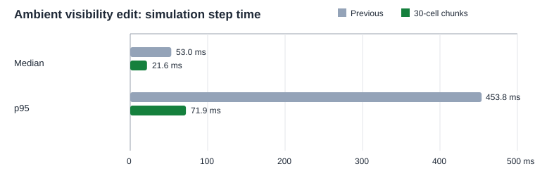

# Ambient illumination chunk performance results

## Change and initial center-sampled verification

Ambient visibility is now sampled once at the in-bounds center of each
30x30-simulation-cell chunk. The sampled ambient classification is shared by
every cell in that chunk. Local emitter illumination remains per-cell, and
effective light remains the maximum of ambient and local light. The chunk size
has one tuning point, `AMBIENT_ILLUMINATION_CHUNK_SIZE` in `physics.js`; change
its value to try another square size, such as `20` for 20x20 simulation cells.
This is independent of screen pixels and zoom.

Focused verification passed:

- Deterministic simulation regressions: **24 passed, 0 failed**.
- Browser illumination regressions: **19 passed, 0 failed**.
- Opt-in performance test: **1 passed**.
- The browser edit regression converged within 120 simulation ticks. It checks
  the chunk-center rule, edge chunks, incremental invalidation and parity with
  a fresh build under the same approximation.

The measurements and test counts in the following sections are the initial
center-sampled implementation run. The later rollback verification is
recorded separately at the end and is the current result.

## Initial center-sampled run (historical)

## Benchmark setup

The run used the existing performance npm harness in its default small-world
scope: 260x150 cells, 39,000 total cells and 23,306 non-empty cells. It used 10
warmups and 60 measured samples per scenario on Windows 10, an Intel Core
i7-10700KF, Node v24.13.0, and headless Chromium 153.0.8010.12. Chromium used
Google ANGLE Vulkan SwiftShader, a software renderer; render values should not
be treated as hardware-GPU performance. The benchmark was not run at the
520x300 world size.

Raw outputs are ignored by Git at `test-results/performance/p0-browser.json`
and `test-results/performance/p0-browser.csv`.

## Ambient edit timings

Values are milliseconds, median / p95. The prior measurements are from the
same-size ambient-visibility-edit row in the 27 September electrical and
hover report. The current build and ambient edit step are from the completed
chunked implementation run.

| Measurement | Previous | Chunked | Change |
|---|---:|---:|---:|
| Simulation step, median | 53.0 ms | **21.6 ms** | 59% lower |
| Simulation step, p95 | 453.8 ms | **71.9 ms** | 84% lower |
| One-time ambient full build | 9,564.4 ms | **18.6 ms** | About 514x faster |
| Incremental update, median / p95 | 0.1 / 0.2 ms | **0 / 0.1 ms** | Lower at displayed precision |
| Render, median / p95 | 2.5 / 2.7 ms | 2.5 / 2.7 ms | Unchanged |

The full-build timings are one-time setup observations (one sample each), not
steady per-tick costs. The reduced work comes from classifying 45 chunk centers
instead of 39,000 cells on a 260x150 world. This run recorded 10,082 ray
traces during the full build; each sampled center can still test multiple
candidate visibility rays.

Slider remapping had a 0.1 ms median and used zero ray traces, while rewriting
the ambient values for all 39,000 cells. During continuous per-tick edits, the
incremental path processed a median of 3 chunks (2,700 cells) per update and
had a median of 42 chunks pending. So the measured update itself is cheap, but
continuous edits can keep the approximate field behind the latest world state.
After edits stop, the bounded queue drains; focused browser coverage observed
convergence within 120 ticks.

## Reading the results

The chunk approximation sharply reduces the initial ambient build and the
ambient-edit step timings in this run. Rendering did not change. The populated
scene still has a current p95 simulation step of 71.9 ms, so this optimization
does not remove all long-frame delays. This benchmark does not attribute that
remaining cost to ambient illumination or identify a separate culprit.

The queue's backlog during continuous edits is the clearest follow-up area.
Consider adjusting its work budget or fallback policy if live, sustained
construction causes visibly stale plant or hover illumination. Slider remaps
are already fast, though they still rewrite the full ambient value array. These
measurements cover only the 260x150 scenario on a software-rendered browser;
rerun on the usual hardware-accelerated browser and at larger worlds before
using the figures as general device expectations.

## Adaptive-refinement rollback verification (2026-09-27)

The rollback restored uniform center-sampled chunks and retained the dirty
chunk queue, slider remapping, ambient visibility rules, and local-source
illumination. The focused simulation suite passed **25/25**, the browser
illumination spec passed **20/20**, and the P0 performance run passed **1/1**
with no missing hooks. The browser cases verified uniform chunk values and
convergence after edits.

The rerun used the 260x150 world (39,000 cells, 23,306 non-empty), with 10
warmups and 60 measured samples. The artifact is
`test-results/performance/p0-browser.json` (ignored by Git). Timings below are
milliseconds. The ambient-visibility-edit step is median / p95; build times
are one-time setup measurements.

| Scenario / metric | Adaptive refinement | Earlier center-sampled run | Rollback run |
|---|---:|---:|---:|
| Ambient visibility edit: full build | 9,658.3 ms | 18.6 ms | 20.2 ms |
| Ambient visibility edit: step median / p95 | - | 21.6 / 71.9 ms | 21.85 / 69.6 ms |
| Open profile: full build | 1.7 ms | - | 1.7 ms |
| Occlusion-dense profile: full build | 521.1 ms | - | 3.8 ms |

In the adaptive mixed-world measurement, 29 of 45 chunks refined to mixed
per-cell values and the build performed 5.58 million ray checks. The earlier
center-sampled build classified 45 chunk centers and recorded 10,082 ray
traces. The rollback ambient-edit build used 45 visibility samples, wrote all
39,000 cells, and traced 10,082 rays. Its open profile built in 1.7 ms with 45
samples and zero rays; its occlusion-dense profile built in 3.8 ms with 45
samples and 20,716 rays. Each build filled all 39,000 ambient cells. The
9,658.3 ms adaptive result and the earlier 9,564.4 ms value above are separate
runs; use the table's scenario-specific figures for this rollback comparison.

The current ambient edit step is close to the earlier center-sampled result:
median changed from 21.6 to 21.85 ms, while p95 changed from 71.9 to 69.6 ms.
The adaptive measurements show the cost of per-cell refinement in these
fixtures; they are historical comparison points, not current performance.
These results cover only the 260x150 software-rendered browser setup. They do
not establish hardware-GPU or larger-world performance.
