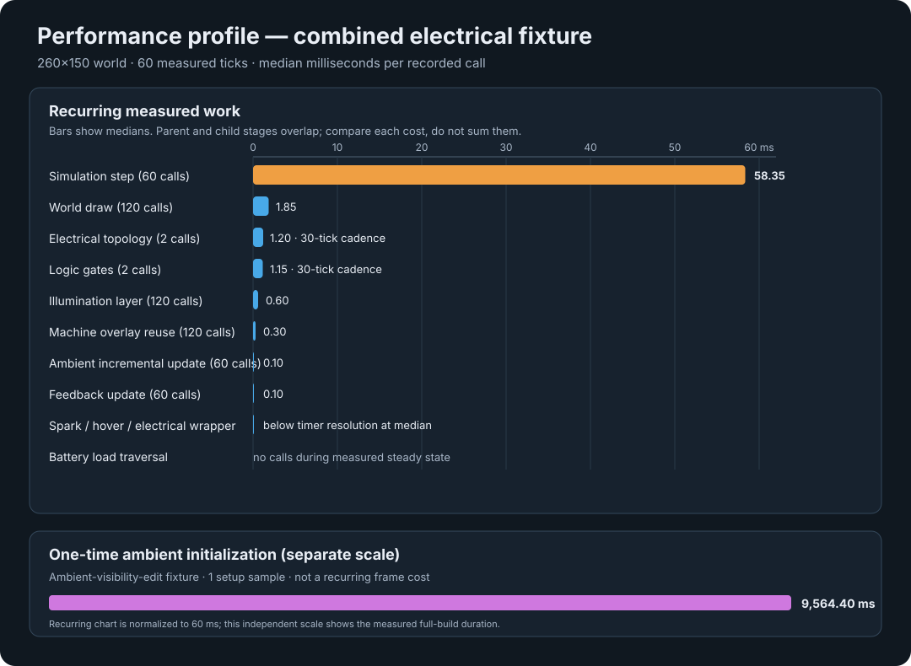

# Electrical, hover, and Battery optimization results — 27 September 2026

## Run scope

The requested opt-in performance run completed with `npm run test:performance`.
It measured eight 260×150 scenarios, with 10 warm-ups and 60 measured samples
per pass: empty control, particle baseline, ordinary Spark, Battery + Lamp,
combined electrical workload, gate chain, Battery hover, and an ambient
visibility edit. The 520×300 matrix exceeded the harness time limit in two
attempts, so this successful run covers small worlds only. No new 520×300
results are available.

The run was recorded at `2026-09-27T02:38:24.989Z`, on commit `62b7c20` with a
dirty working tree. Environment: Windows 10 x64 build 10.0.26200, Intel
Core i7-10700KF at 3.80 GHz, 16 logical CPUs, 64 GiB RAM, Node v24.13.0, and
headless Chromium 153.0.8010.12. The browser used Google ANGLE Vulkan
SwiftShader, a software renderer; render timings are not representative of a
hardware GPU. Raw ignored outputs are `test-results/performance/p0-browser.json`
and `.csv`.

## Whole-step and render results

These timings come from the instrumentation-off pass. Values are median / p95
milliseconds. The previous values are from the 260×150 rows in the
[26 September report](2026-09-26-p0-performance-results.md). Bold current
values have a lower median than that comparable prior run.

| Scenario | Non-empty cells | Prior step | Current step | Prior render | Current render |
|---|---:|---:|---:|---:|---:|
| Empty control | 0 | 5.65 / 6.40 | **4.60 / 4.80** | 0.70 / 0.80 | 0.70 / 0.80 |
| Particle baseline | 23,473 | 19.40 / 24.30 | 60.90 / 467.10 | 3.40 / 3.60 | **2.40 / 2.60** |
| Ordinary Spark | 25,424 | 23.00 / 28.00 | 62.40 / 467.80 | 5.30 / 5.70 | **2.50 / 2.70** |
| Battery + Lamp | 23,722 | 20.20 / 24.70 | 55.65 / 472.40 | 4.20 / 5.80 | **2.80 / 3.10** |
| Combined | 25,673 | 24.90 / 29.00 | 57.20 / 467.00 | 5.85 / 6.20 | **2.90 / 3.10** |
| Gate chain | 23,495 | — | 57.70 / 471.80 | — | 2.70 / 2.90 |
| Battery hover | 23,722 | — | 52.65 / 470.10 | — | 2.80 / 3.10 |
| Ambient visibility edit | 23,306 | — | 53.00 / 453.80 | — | 2.50 / 2.70 |

The populated-scene median simulation step is now 52.65–62.40 ms, with p95
stalls from 453.80 to 472.40 ms. That is a severe long tail and is enough to
explain poor frame pacing on this test host. The render medians improved in all
four populated fixture comparisons, but rendering at roughly 2.4–2.9 ms does
not account for the much larger simulation-step cost. The empty control also
improved; the difference is consistent with a workload cost in populated
scenes, though fixture and run variation prevent isolating its cause.

The chart uses median time per recorded call for the combined fixture; bars are
not additive. The full simulation tick contains many of the instrumented
stages. Electrical topology and gate solving each ran only twice in the 60
measured ticks; Battery load traversal had no measured event after setup. The
ambient full-build bar is a separate one-time setup event for the ambient-edit
fixture, not recurring frame work.

## Functional-area timings

This table uses the instrumented combined fixture and shows median / p95
milliseconds per hook call. Calls and cadence differ, so compare like rows and
do not add these nested timings to estimate a frame total.

| Area | Samples | Median / p95 ms | Reading |
|---|---:|---:|---|
| Full simulation step | 60 | 58.35 / 468.40 | Largest recurring cost by a wide margin. |
| World draw | 120 | 1.85 / 3.00 | Two recorded calls per measured frame. |
| Electrical topology refresh | 2 | 1.20 / 1.30 | About 0.04 ms per simulation tick averaged over the 30-tick refresh cadence. |
| Logical gate solve | 2 | 1.15 / 1.20 | Same 30-tick cadence; two gates in this fixture. |
| Gate-chain topology refresh | 2 | 3.05 / 3.80 | Separate two-gate chain fixture; one refresh every 30 ticks. |
| Gate-chain logical solve | 2 | 3.00 / 3.70 | Same refreshes as above; nested timing, so do not add it to topology time. |
| Illumination render layer | 120 | 0.60 / 1.60 | Repeated draw-layer work, much smaller than the full simulation step. |
| Static machine overlay reuse | 120 | 0.30 / 0.40 | Reused artwork path; one machine per combined fixture. |
| Ambient incremental update | 60 | 0.10 / 0.20 | Incremental work in this fixture is small per tick. |
| Feedback update | 60 | 0.10 / 0.20 | Hover feedback is inexpensive in this profile. |
| Electrical power refresh wrapper | 60 | 0.00 / 0.00 | Below the browser timer's effective resolution in the sampled calls. |
| Ordinary Spark propagation | 60 | 0.00 / 0.00 | One Spark fixture; measured medians and p95 are below timer resolution. |
| Hover hit test | 60 | 0.00 / 0.00 | Cached pointer result; below timer resolution here. |
| Battery load traversal | 0 | — | Cached during fixture setup; no traversal occurred in measured steady state. |

The ambient-visibility-edit setup recorded one `ambientIlluminationFullBuild`
call at **9,564.40 ms**. Treat this as an initial/full-build cost for that
fixture, not as per-frame work. The current incremental-update samples were
0.10 / 0.20 ms per call, although the counter still showed a large pending
queue during the edit fixture. The initial build and queue-drain behavior need
their own follow-up profile before drawing conclusions about their user-visible
latency.

## Conclusions and next work

1. Focus the next CPU investigation inside `stepSimulation`. The coarse hook
   wraps the simulation but does not yet name the expensive particle-physics
   substeps. Add targeted timings for the dominant particle update paths and
   compare fixed material counts with electricity and light independently
   toggled.
2. The current data does not support blaming Battery trend artwork, hover
   hit-testing, the electrical refresh, gate solving, or Spark traversal for a
   50–60 ms recurring tick in these small-world fixtures. Topology and gate
   solving took at most about 3 ms per occasional call in the two-gate chain;
   Battery hover and Spark propagation remained below timer resolution in
   their fixtures. The dedicated Battery-hover case did not reproduce the
   reported cursor-related FPS collapse.
3. Investigate the 9.56-second ambient full-build sample and the edit fixture's
   pending-target queue. The incremental update itself is cheap, but that alone
   does not establish that the initial build or catch-up latency is acceptable.
4. Rendering is improved against the previous same-size run. Verify on the
   user's normal hardware-accelerated browser before optimizing graphics based
   on this software-rendered run.
5. The large p95 tail merits repeat profiling with representative in-game
   worlds and a longer trace that captures simulation substeps, task gaps, and
   memory/GC evidence. This benchmark does not identify the cause of those
   stalls.

The performance suite remains opt-in and should run only for a performance
request. The full-size profile can be run separately when needed with
`P0_PERFORMANCE_SCOPE=all`; it was not part of this result.
